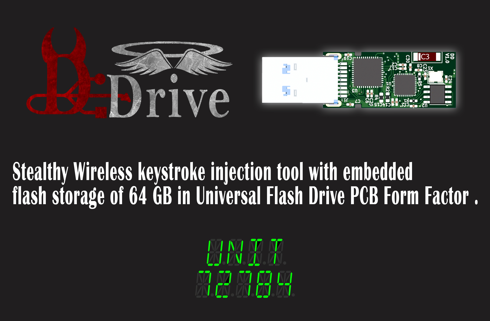
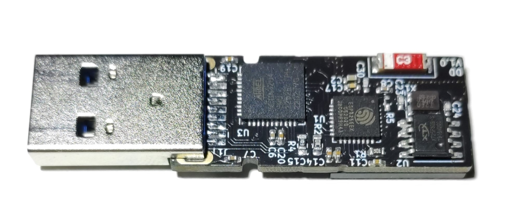

# Diabolic Drive

---
* [About](#about)
* [Why Diabolic Drive ?](#why-diabolic-drive-)
* [Features](#features)
* [How Stealthy can Diabolic Drive go ?](#how-stealthy-can-diabolic-drive-go-)
* [Firmware Supported](#firmware-supported)
* [Programming](#programming)
  + [ESP8266](#esp8266)
  + [ATMEGA32U4](#atmega32u4)
  + [Access ATMEGA32U4 Bootloader](#access-atmega32u4-bootloader)
* [Technical Specifications](#technical-specifications)

## About

Diabolic Drive is a Red Teaming and penetration testing tool that injects keystrokes wirelessly .. in addition to its innocent look of a regular Flash Drive it also functions the same as it looks with a real capacity of 64 GB making it stealthy and not suspicious when plugged in and gives it the ability to be used in countless Social Engineering scenarios .. reviving the Hotplug Attack Vector , revolutionizing and introducing a new concept of bad USBs .

---

## Why Diabolic Drive ?
As for USB devices what is the most common device that has higher chances for a user to plug it in ? putting a Flash Drive with a cable in comparison for sure a Flash Drive will easily win .. thinking about how many times I plugged a cable into my laptop I only remember a few times compared to how many times I plugged a real Flash Drive into it which is near to million times ! but taking only the Form Factor of a Flash Drive is really silly and will not trick an adult ! so I implemented a real flash storage memory of 64 GB inside the heart of Diabolic Drive so when you plug it in you can interact with a real flash storage that can be used completely as a normal flash drive would be .. giving you unlimited possible social engineering scenarios to trick the targeted client to do what is intended , planned by you to do .

## Features
Diabolic Drive hardware was squeezed to get highest level of capabilities out of it with many stealthy features in mind and was designed to give user maximum openness , flexibility , control over it and finally to be future-proofed .
- **Features ready** :
  + ATMEGA32U4 and ESP8266 are connected to each other over both Serial and I2C protocols which means that Diabolic Drive supports running almost every Open-Source    software out there that is built for the same 2 chips . ex: WIFI DUCK , WIFI DUCKY, ESPloitV2 ,WHID , supremeDuck and much more ! 
  + Flash Storage supports reading , writing data while firing your payload wirelessly at the same time .
  + Control over WIFI with any device, using a simple web interface .
  + Hardware ID Cloning  .. not on the fly though ! 

- **Features need custom software but are supported by the hardware .** ( these features are separately supported by the Open-Source Software mentioned in the Features ready section above )

   + OS detection allowing it to work on Windows, Linux, and macOS.
   + alt + numpad combinations on Windows (to type correct characters regardless of system language).
   + mouse control
   + ASCII characters
   + Serial Data Exfiltration to the ESP memory .
## How Stealthy can Diabolic Drive go ?
**there are 3 main features that make Diabolic Drive very Stealthy**
- PCB design is in Universal Flash Drive PCB shape .. for any person with a good security awareness plug in a generic look or very old fashioned USB 2.0 flash drive ( also has no embedded flash storage on it by the way ) might be a big problem so I decided to go with the trendy shapes of modern look USB3.0 flash drives and the most common available models , doing lots of recon getting many many models disassembled , identified the PCB dimensions and finally I managed to get a UNIVERSAL PCB shape that I need to design my PCB identical to it to help the Diabolic Drive be much more stealthy hiding itself in many many common USB 3.0 flash drive enclosures out there ! 
 
 **Disclaimer :  Enclosure in image below is for demonstration purposes only !**

- plug in your Diabolic Drive to a USB port will raise only one USB plug in sound just like the notification you hear when connecting a normal Flash Drive so your victim will never think there is more than one device connected to his computer at the same time .
- a stealthy mode that can be preprogrammed and makes your computer read the ATMEGA32U4 as one HID device hiding its identity of running an Arduino Bootloader and its COM port from the WINDOWS device manager
## Firmware Supported
Diabolic Drive supports every firmware out there runs on the same 2 chips ( ATMEGA32U4 , ESP8266EX ) both Serial and I2C connection between the 2 chips is fully supported .. for example out of these open source firmware is : 

- [WIFI DUCK](https://github.com/SpacehuhnTech/WiFiDuck)
- [supremeDuck](https://github.com/michalmonday/supremeDuck)
- [WIFI DUCKY](https://github.com/spacehuhn/wifi_ducky)
- [ESPloitV2](https://github.com/exploitagency/ESPloitV2)
- [WHID](https://github.com/whid-injector/WHID/)

## Programming
### ESP8266
   + OTA ( Over The Air ) through its web interface
   + through ATMEGA32U4 acting as a Serial Bridge giving you full control over it in case something went wrong (also supports NodeMCU Firmware Programmer App )
### ATMEGA32U4
   + Uploading Arduino Sketches : by directly plug your Diabolic Drive into the computer as ATMEGA32U4 has native USB support through USB transceiver built into it that handles the USB connection .
### Access ATMEGA32U4 Bootloader
   + This gives you the full control over ATMEGA32U4 and can be accessed through USB3.0 defined pins .. not forget to mention Diabolic Drive uses Arduino Leonardo          Bootloader 

## Technical Specifications
- ATMEGA 32U4 running at 16MHz and 5V .
- ESP8266ex running at 160MHZ at 3.3v thanks to LDO Regulator .
- ESP8266ex has 4MB of memory able to store 4 million characters to save your payloads .
- High gain 4.1dBi ceramic chip 2.4G Wireless antenna.
- 64GB Flash Storage with average reading and writing speed of 20MB/s , 10MB/s respectively .

